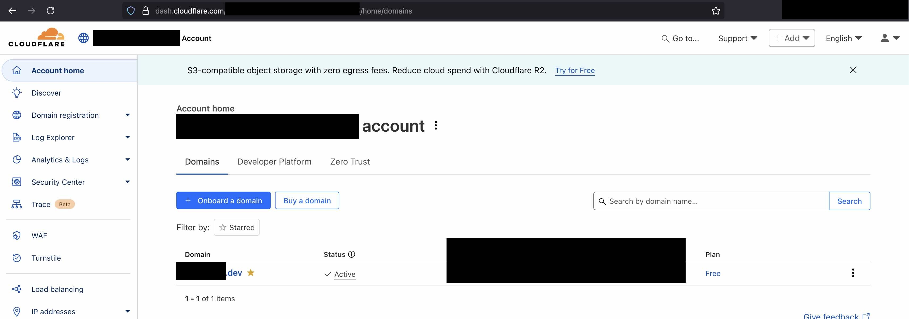
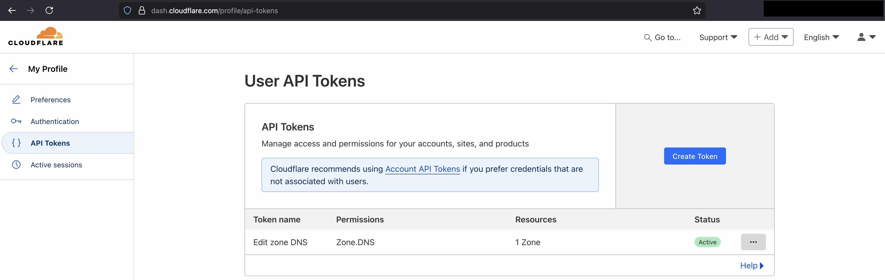
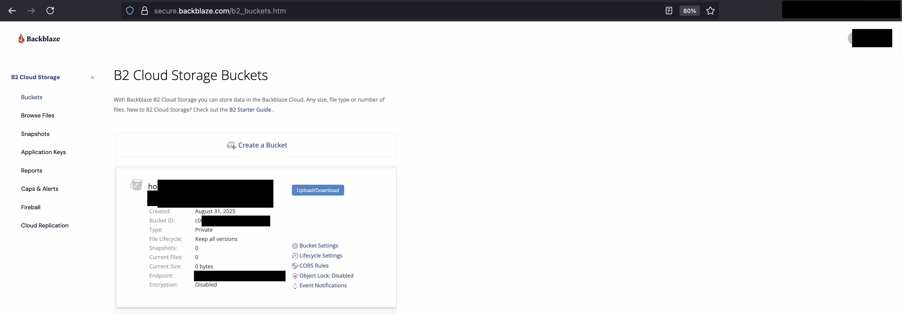
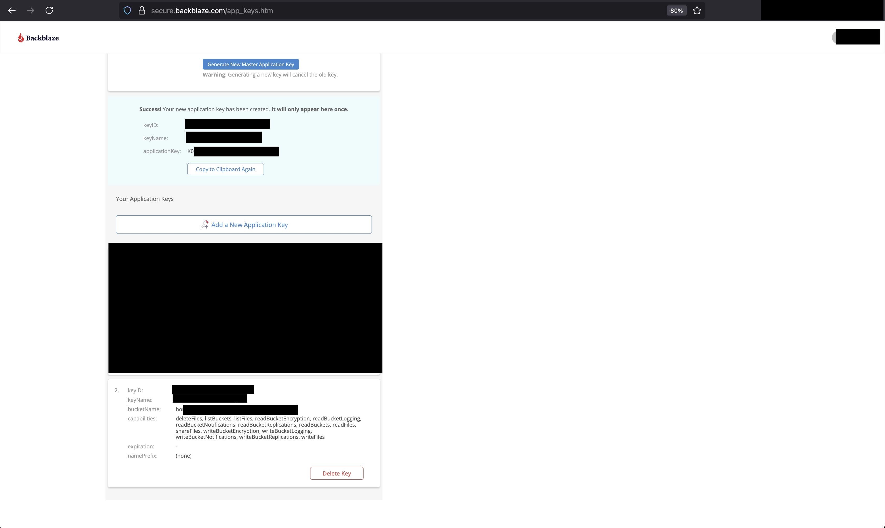

# Auto-homelab

## Prerequisites

### Software

You will need the following software installed on your computer:

- [Docker](https://www.docker.com/get-started/)
- [Just](https://github.com/casey/just)
- [uv](https://github.com/astral-sh/uv)
- [restic](https://restic.readthedocs.io/en/stable/020_installation.html)

### A CloudFlare domain

You need to purchase a public domain from CloudFlare. Say you purchased the domain `whatever.dev`. When you login to your
cloudflare dashboard, you will see the following:



You need to go to your Profile, section "User API Tokens", and create an "Edit Zone DNS" token. Make sure the token
only applies to the domain you want to use for this homelab.



You will need to provide the token's value when you are asked for the `HOMELAB_TRAEFIK_CLOUDFLARE_API_TOKEN` variable.

### A Backblaze B2 bucket

Open a Backblaze B2 account and create a bucket:



You need to use the bucket's ID (`c0..` on the screenshot) when you are asked for the
`HOMELAB_BACKUP_RESTIC_REPOSITORY` variable. This variable should contain the following:
```
b2:/<bucket_id>:<directory_inside_bucket>/
```

Then, go to Application Keys and create a new key that gives write access to the bucket:



From this page you will need the following data:
- When you are asked for the `HOMELAB_BACKUP_B2_KEY_ID` variable, provide the `keyID` shown on the screenshot
- When you are asked for the `HOMELAB_BACKUP_B2_APPLICATION_KEY` variable, provide the `applicationKey` shown on the
screenshot. This key is only shown once, so make sure you save it somewhere safe.

## How to use

You can get a list of all the available commands, along with a small explanation, by running:
```shell
just
```

- Commands whose documentation starts with `[🔧APP]` provide the functionalities of this project.
- Commands whose documentation starts with `[🧪DEV]` are for development purposes only. You should
not use them unless you are contributing to this project.

TODO... This section is under construction ...

### Create the environment variables file

TODO ...

### ⚠️🚨⚠️ WARNING: Save the following variables on an alternative backup location ⚠️🚨⚠️

You should **save the variables below on an alernative backup location**. My preference would be saving them in a password
manager such as Bitwarden.

- **`HOMELAB_BACKUP_RESTIC`**: It is **VERY IMPORTANT** to save this variable. If you lose it, you will not be able to decrypt
the backup files, so they will be useless.
- **The web passwords of all the services**: Except for unusual cases like Adguard, you will create a password for each
service through its web interface, the first time you access it. These passwords end up being stored in databases.
And those databases are saved to the backup in B2. When you restore a service, you will need to provide the old
password. Therefore, you should save the web passwords in a password manager.

Of course, you should already be saving in a password manager some of the secrets you have been asked for when
configuring the homelab, such as:
- `HOMELAB_TRAEFIK_CLOUDFLARE_API_TOKEN`
- `HOMELAB_BACKUP_B2_APPLICATION_KEY`

## Project structure - TODO move to CONTRIBUTING.md

- `Justfile`: contains all the commands that are used to run the app, and to develop new features for the app
- `docker-compose.yml`: contains the definition of all the services the homelab is composed of
- `pyproject.toml`, `uv.lock`, `.python-version`: these files are used by `uv` to manage the Python environment
- `documentation/`: in this directory you will find several articles documenting different aspects of the project. Some of
these are for my own reference, so that I can remember how I did something.
- `files/`: contains configuration files and scripts for various services
- `scripts/`: contains Python scripts that give this project some of its functionality
- `scripts-shell/`: contains shell scripts that provide some extra functionalities
- `scripts/configuration/env.config.json`: this file contains the schema of the environment variables that are used by the app

## Disaster recovery: How to restore the services once we have restored the backup files

### Important notes

#### ALL EXISTING DATA WILL BE LOST
Recovery scripts assume that you want to destroy a service instance and rebuild it from the ground up.
Therefore, they will remove all existing data before restoring the backup files.

#### Directory permissions
For some reason Docker changes the ownership and permissions of some directories,
so it is possible that this script fails due to that. If this happens, set yourself manually (chown)
as the owner of the problematic files

### Restoring Calibre

Just copy the files over. Navigate to this project's root directory and run:

```shell
source .env
export RESTORED_HOMELAB_CALIBRE_CONF_PATH=<path_to_your_restored_calibre_config>
export RESTORED_HOMELAB_CALIBRE_LIBRARY_PATH=<path_to_your_restored_calibre_library>
cp -r $RESTORED_HOMELAB_CALIBRE_CONF_PATH/* $HOMELAB_CALIBRE_CONF_PATH
cp -r $RESTORED_HOMELAB_CALIBRE_LIBRARY_PATH/* $HOMELAB_CALIBRE_LIBRARY_PATH
```

You will need to replace the placeholders above (`<path_to...>`) with the correct values.

### Restoring Firefly III

1. Make sure the Firefly database container is not running
2. Run the following command:

```shell
source .env
export RESTORED_HOMELAB_FIREFLY_DB_SQL=<path_to_your_restored_firefly_db_sql>
docker compose up -d --no-deps firefly-db
sleep 20 
docker exec -i "${HOMELAB_FIREFLY_DB_CONTAINER_NAME}" mariadb -u"${HOMELAB_FIREFLY_DB_USER}" -p"${HOMELAB_FIREFLY_DB_PASSWORD}" "${HOMELAB_FIREFLY_DB_DATABASE}" < "${RESTORED_HOMELAB_FIREFLY_DB_SQL}"
```

You will need to replace the placeholder shown above (`<path_to...>`). It should contain the absolute path to the SQL file 
that contains the restored Firefly III database.

#### Notes

- The service is started by its name: `firefly-db`. This name is hardcoded in the `docker-compose.yml` file, it's not the name of the container.
- The `sleep 15` command is needed because the database takes a while to start up.

### Restoring Paperless-ngx

The backup uses the [document exporter](https://docs.paperless-ngx.com/administration/#exporter) tool,
hence the recovery script uses the [document importer](https://docs.paperless-ngx.com/administration/#importer) tool.

The restoration is performed by running the following command:

```shell
just restore-paperless
```

Notes:
- Ensure a valid `.env` file exists in the project root before running the command.
- You will be prompted for the path to your restored Paperless-ngx export data.
- If you performed the backup using this project, the backed-up files will contain
the username and password for the Paperless-ngx account. Use these credentias to
log in after the restoration is complete.

### Restoring Immich

See [Immich docs on restoring data](https://immich.app/docs/administration/backup-and-restore/).

The restoration is performed by running the following command:

```shell
just restore-immich
```
